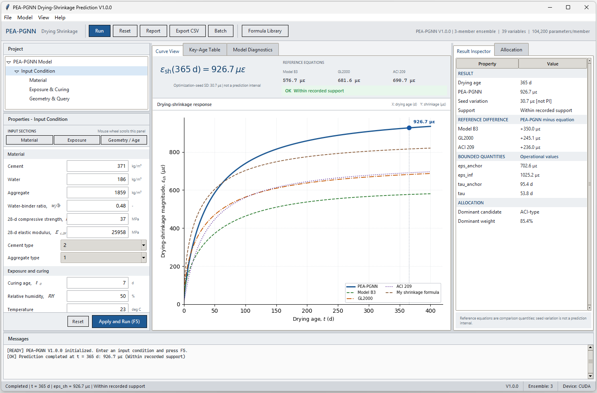
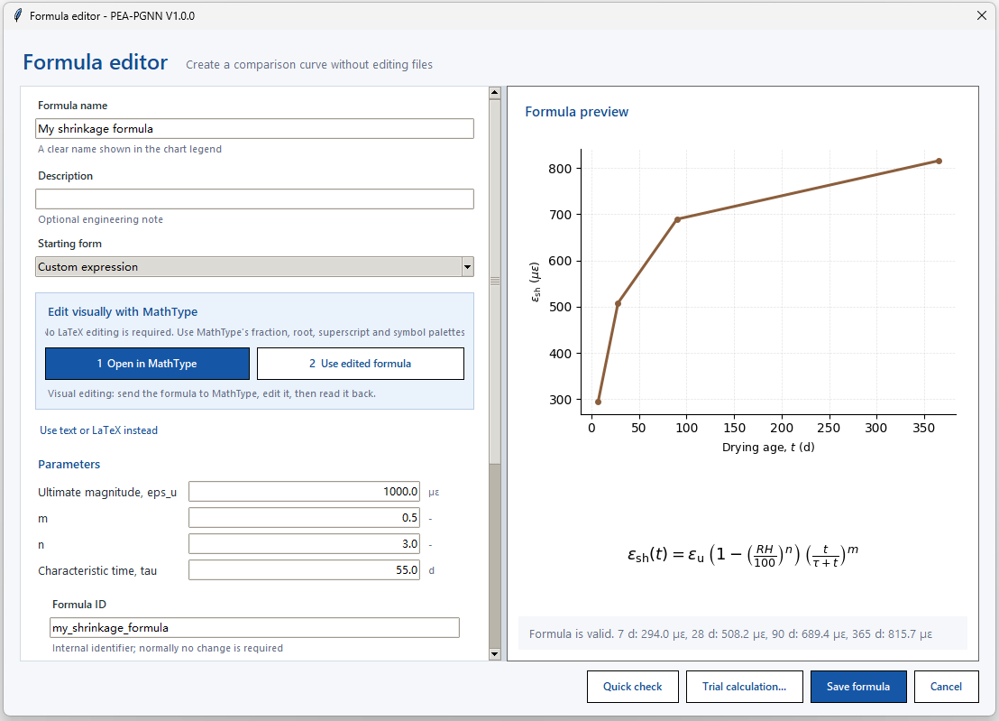
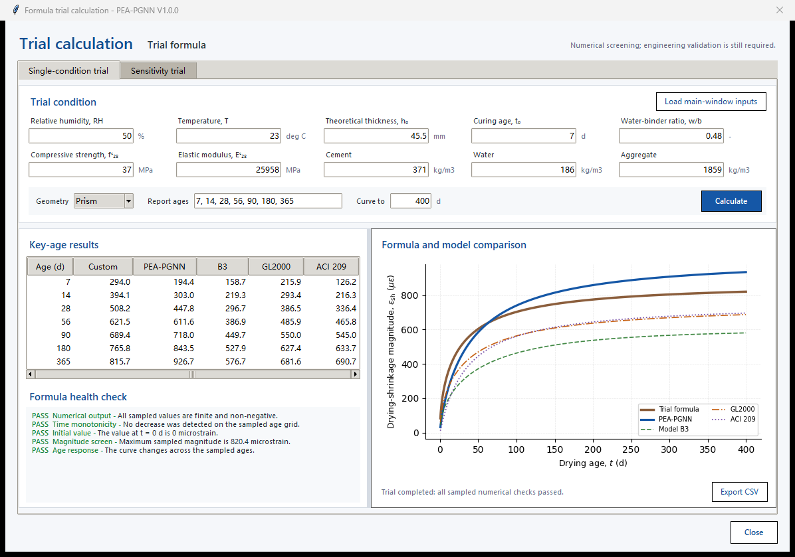

# PEA-PGNN Drying-Shrinkage Prediction GUI

[](CHANGELOG.md)
[](https://github.com/hunter137/pea-pgnn-drying-shrinkage-gui/actions/workflows/tests.yml)
[](https://github.com/hunter137/pea-pgnn-drying-shrinkage-gui/releases)
[](LICENSE)
[](https://www.python.org/)
[](docs/INSTALLATION.md)
[](MODEL_CARD.md)

A standalone Windows engineering workbench for checksummed PEA-PGNN concrete
drying-shrinkage prediction, reference-equation comparison, protected custom
formula editing, numerical trials, batch processing, and deterministic PDF
calculation reports.

This repository is an independent desktop application. It is not merged into
the reusable [`hunter137/pea-pgnn`](https://github.com/hunter137/pea-pgnn)
Python-package repository.

> **Research-use boundary:** the software reports point predictions and
> recorded validation evidence. It is not a design certificate, does not claim
> a nominal prediction interval, and does not replace experiments, applicable
> design codes, project-specific verification, or independent engineering
> judgement.



## What is included

- a restrained MATLAB/Abaqus-style Windows workbench with menu, project tree,
  scrollable property sheet, curve viewport, result inspector, diagnostics,
  messages, and device status;
- a checksummed three-member PEA-PGNN V1.0.0 deployment ensemble with a frozen
  39-variable feature contract and 104,200 parameters per member;
- exact key-age evaluation, reference comparisons with B3, GL2000, and ACI 209,
  input-support diagnostics, curve CSV export, and row-isolated batch CSV
  prediction;
- CPU inference and automatic CUDA use when a compatible PyTorch/CUDA build is
  available;
- standard engineering and complete technical PDF calculation reports with
  document control, formulas, tables, curves, sign-off, and model audit data;
- a safe formula library with read-only built-ins, custom packages, local
  history, archive recovery, quarantine, and atomic saves;
- guided templates, supported LaTeX/Unicode/calculator conversion, optional
  MathType MathML round trips, instant previews, engineering trial calculation,
  and one-variable sensitivity screening; and
- 36 automated tests covering the scientific contract, artifact loading,
  formula conversion and safety, GUI scrolling, inference, trials, and reports.

## Quick start on Windows

Clone the repository and install it in an isolated environment:

```powershell
git clone https://github.com/hunter137/pea-pgnn-drying-shrinkage-gui.git
cd pea-pgnn-drying-shrinkage-gui
python -m venv .venv
.\.venv\Scripts\python.exe -m pip install --upgrade pip
.\.venv\Scripts\python.exe -m pip install -r requirements.txt
.\.venv\Scripts\python.exe run_gui.py
```

After the dependencies are installed, `launch_gui.bat` can also be
double-clicked. See [Installation and startup](docs/INSTALLATION.md) for CUDA,
MathType, and retraining notes.

## Main workflow

1. Enter the material, exposure, curing, geometry, and reporting-age values in
   the left property sheet. The mouse wheel works over labels, entries, units,
   and selectors; the shortcuts above the fields jump to each section.
2. Select **Run** or press **F5**.
3. Review the calculated curve, exact key-age table, reference differences,
   input-support result, and model diagnostics.
4. Export the curve, run a batch CSV calculation, or generate a standard or
   technical PDF calculation report.

The deployed result at the requested age is a point prediction. The displayed
ensemble-member standard deviation is optimization-seed dispersion only, not
a calibrated prediction interval.

## PDF calculation reports

After a successful run, select **Report** to export the calculation currently
shown in the workbench. The exporter does not rerun the case, change the input
condition, or alter the model and formula libraries.

The **standard engineering report** records project and document information,
input quantities and units, the requested-age result, key-age values, comparison
curves, applicability checks, the formula register, and preparation/review
fields. The **complete technical report** adds a model-audit appendix containing
the deployment configuration, ensemble record, validation summary, artifact
identity, and internal calculation quantities. A traceable report ID is assigned,
and the saved PDF's SHA-256 digest is written to the application message log.

## Formula editor and numerical trials



Built-in B3, GL2000, and ACI 209 formulas are protected and cannot be edited,
disabled, archived, or removed. Use **Copy as custom** to create an editable
comparison curve without changing the trained network.

Normal users can choose a starting form and edit named parameters. Supported
published notation can be converted locally into a restricted calculation,
and desktop MathType can be used as an optional visual editor. Arbitrary
Python, imports, attribute access, files, and shell commands are rejected.



Before saving, the trial workbench compares the unsaved formula with PEA-PGNN
and the native references, evaluates selected ages, checks numerical health,
and exports the curve. The sensitivity tab changes one quantity at a time; it
is a screening tool, not global sensitivity analysis or experimental
validation. See [Formula editing and safety](docs/FORMULA_SAFETY.md).

## Formula-data protection

User formulas are stored outside the source tree under:

```text
%LOCALAPPDATA%\PEA-PGNN\V1.0.0\FormulaData
```

The active library, archive, revision history, and quarantine are separated.
Archive replaces permanent deletion, initial and pre-edit snapshots support
recovery, and a damaged package cannot prevent the native formulas or trained
model from loading.

Custom formulas are comparison curves in V1.0.0. Using a different equation as
an internal neural-network prior requires a revised feature contract, a new
model version, and retraining.

## Reproducibility and artifact integrity

At startup, the application verifies every model, preprocessing, and support
file listed in `artifacts/deployment/manifest.json` against its SHA-256 digest.
The manifest also records:

- the three ensemble seeds and fixed training epoch count;
- architecture and frozen feature-schema information;
- research-population and split identities;
- recorded independent later-age audit statistics;
- Python, PyTorch, CUDA, and training-hardware information; and
- the explicit absence of a nominal prediction interval.

The deployment model is fitted on all development records and is not presented
as an independent test fit. See [MODEL_CARD.md](MODEL_CARD.md) for intended use,
metrics, limitations, and interpretation.

## Testing

Run the repository tests and GUI smoke check with:

```powershell
python -m unittest discover -s tests -v
python run_gui.py --smoke
```

Dataset-dependent identity and split-leakage tests run when authorized local
copies of the private frozen research data are placed at the paths configured
in `configs/training.json`; those two tests are skipped in the public CI. All
deployment, inference, formula, GUI, and reporting tests run from the public
repository. GitHub Actions repeats these public checks on every push and pull
request.

## Retraining

The trained deployment artifacts required for inference are included. The raw
8,729-record research database, frozen condition-disjoint split, audit-fold
weights, logs, predictions, manuscript files, and user formula data are not
published in this repository.

Authorized researchers can point `configs/training.json` to local copies and
run:

```powershell
python train.py --mode audit --cpu-threads 12
python train.py --mode deployment --cpu-threads 12
```

Training uses CUDA automatically when available and otherwise uses the CPU.

## Project files

- [Installation and startup](docs/INSTALLATION.md)
- [Formula editing and safety](docs/FORMULA_SAFETY.md)
- [Model card](MODEL_CARD.md)
- [Changelog](CHANGELOG.md)
- [Citation metadata](CITATION.cff)
- [Security policy](SECURITY.md)
- [Contributing](CONTRIBUTING.md)

## License and citation

The source code and bundled deployment artifacts are released under the
[MIT License](LICENSE). If this software contributes to research, use the
repository's **Cite this repository** entry generated from `CITATION.cff`.
